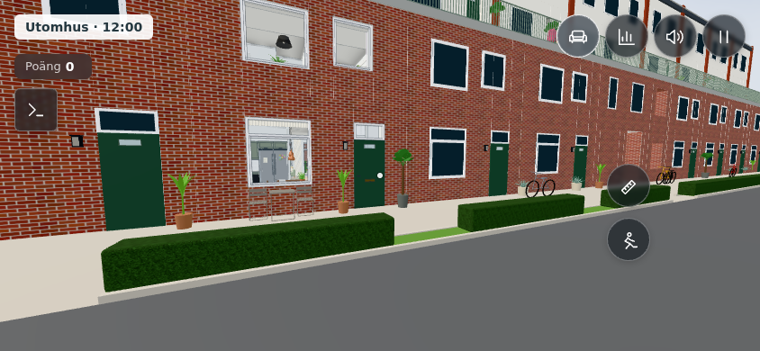
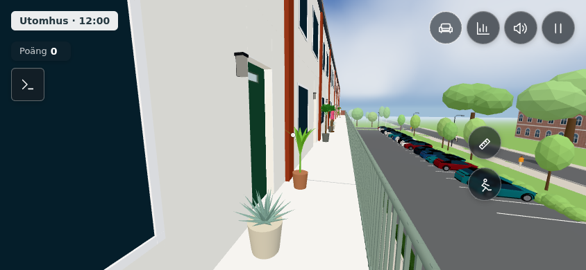
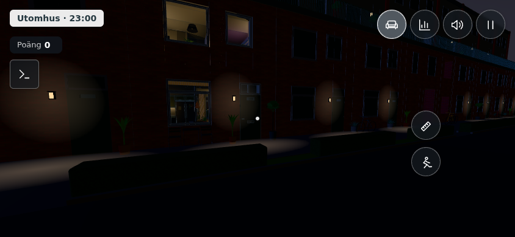
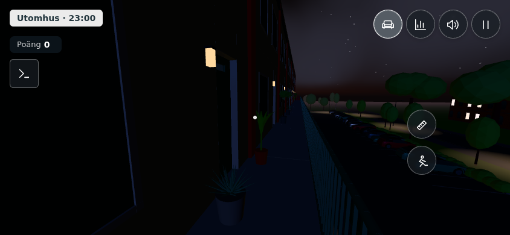

# Entréväxter, issue #498

Peabs [referensbild](../../references/framsida-hack-dorrar-planteringar-2026-10-08.jpg) visar små grupper vid fasaden. Nu finns 11 krukväxter på markplan och 11 på loftgången, fördelade på husets åtta entréer på respektive nivå. Palm, bananväxt och agave återanvänder uteplatsens växtbyggare. Grå, terrakottafärgade och ljusa krukor varierar mellan grupperna. Inga nya möbler ingår.

Antal, artval, placeringar, krukornas radie 16–20 cm och höjd 32–40 cm, samt bladverkets proportioner är **visuella antaganden**, samlade i `ENTRANCE_PLANTS` i `src/config.js`. Bilden är ingen måttsatt ritning. Golvhöjden följer befintlig markmodell respektive loftgångens faktiska golv. Bladverkets radie begränsas så att varje blad håller sig utanför fasad och dörröppning. Den yttre delen av loftgången förblir fri; trappor, hiss och portik har inga nya krukor.

Krukor och centrala stammar får åttkantiga kollisionsytor; de bredare bladspetsarna hindrar inte gång. Samma växtvariant delar geometri och material, med sammanslagna blad i en mesh. Befintlig avståndsgallring och frustumgallring används utan nya renderpass eller lampor.

`tools/entranceplantstest.html`: 14 kontroller passerar, inklusive faktiska bladvertexar, golvkontakt, återanvänd geometri, gång längs loftgången åt båda håll, markpassage, krukkollisioner och verklig öppning/passage genom vår ytterdörr. `tools/walktest.html`: hela gångtestet passerar.

## Mobilvy, dag

| Markplan | Loftgång |
|---|---|
|  |  |

## Mobilvy, kväll

| Markplan | Loftgång |
|---|---|
|  |  |

Verifierat i Chromium med telefonvy 844 × 390, även från tidigare version med samma kameror. Detta är renderstatistik i webbläsare, inte FPS-mätningar på en fysisk telefon.

| Vy | Före: ritningar / trianglar | Efter: ritningar / trianglar |
|---|---:|---:|
| Markplan, dag | 869 / 816 141 | 916 / 823 061 |
| Loftgång, dag | 177 / 364 551 | 214 / 370 375 |
| Markplan, kväll | 866 / 778 201 | 913 / 785 121 |

Ökningen är 37–47 ritningar och cirka 5 800–6 900 trianglar i dessa vyer. Ingen separat mesh per blad och inga nya skuggpass. Kvällsvyn på loftgången visar 204 ritningar / 333 291 trianglar efter ändringen.
