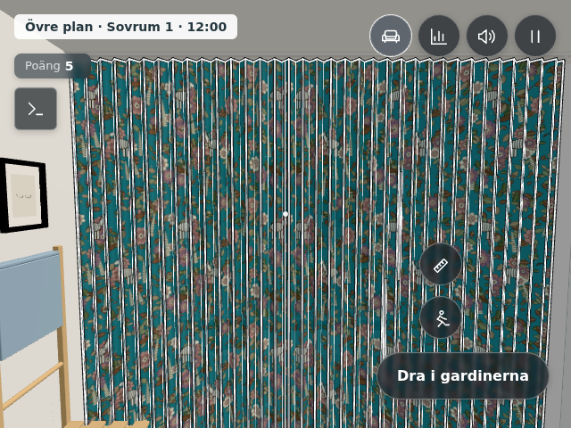
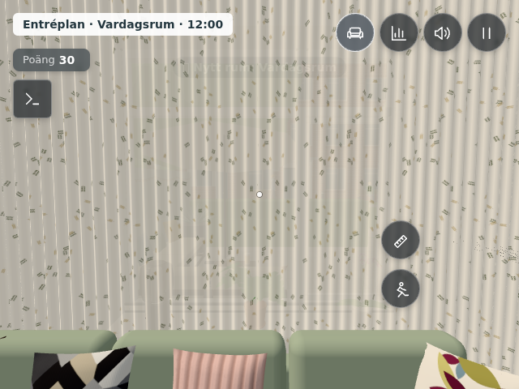
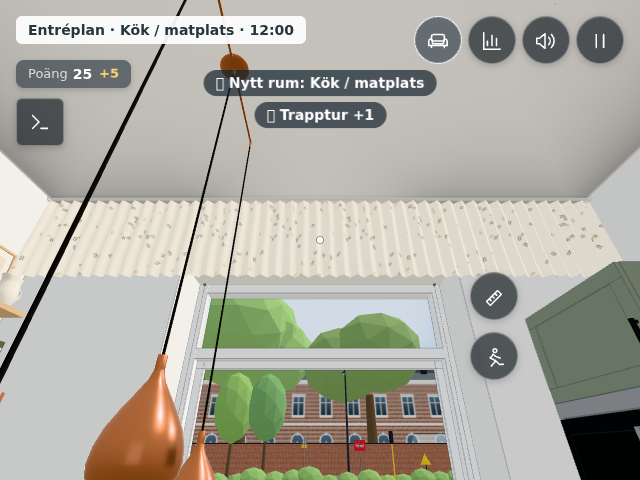
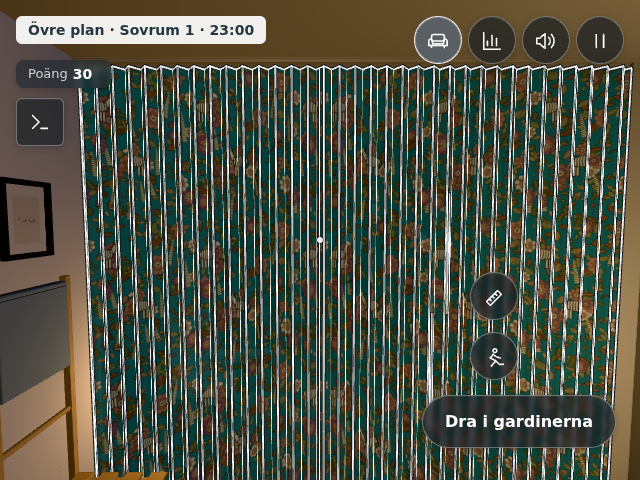
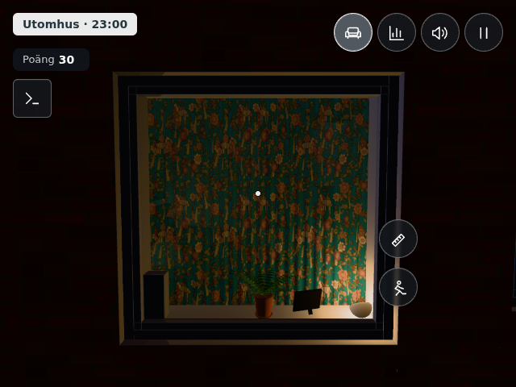

# Diffust ljus genom takskenornas gardiner, #499

Samtliga sex gardinuppsättningar omfattas: Sovrum 1–4, kökets kappa och vardagsrummets tre längder. Mönster, färger, veck, skenor, mått, rörelse och lagringsnycklar behålls.

`CURTAIN_LIGHT` i `src/config.js` samlar **visuella antaganden**, inte uppmätt textildata: opacitet 0,94, diffus ljustransmission 0,46, råhet 0,96 och modest förstärkning av dagsljusets respektive rummets varma genomlysning. Tyget är lätt transparent, matt och fortfarande mönstrat. En enda djupkontrollerad pass per tygmesh undviker dubbel blandning av det dubbelsidiga tyget; tätt samlade veck behåller sin täthet.

Direkt solljus stoppas av tygmeshens vanliga täta skugga. Genomsläppt dagsljus representeras i rummets befintliga diffusa hemi-, ambient- och fill-ljus via gardinernas täckningsgrad. Därmed innebär ändringen både materialtransparens och ändrad rumsbelysning, utan nya ljuskällor eller extra renderpass. Detta är en billig ljusapproximation, inte fysisk volymspridning. Den korta kökskappan har fortsatt endast en liten effekt på rummets dagsljus, eftersom fönstret nedanför lämnas fritt.

Plisségardinerna använder sina tidigare material, dimning och vertikala kontroller. Gardinernas ljus kombineras med deras täckning som tidigare.

Verifierat i riktig Chromium-webbläsare med telefonvy 640 × 480: alla sex uppsättningar inifrån och utifrån vid 12:00 och 23:00 med rumsbelysning tänd. Inga gryniga ytor, skarpa solhål eller synliga sorteringsproblem mellan vecken i dessa vyer. `curtaintest` kontrollerar dragning med tangentbord och pekare, stängda/öppna lägen, paneler och skenor, plissésamspel, verklig omladdning av alla sex sparade lägen, samt material och dags-/kvällsgenomlysning. `blindtest` passerar.

## Exempel, dag

| Sovrum 1 | Vardagsrum | Kökskappa |
|---|---|---|
|  |  |  |

## Exempel, kväll

| Sovrum 1 inifrån | Sovrum 1 utifrån |
|---|---|
|  |  |

93 gardinkontroller och 32 plissékontroller passerar. Jämförelse med föregående version, samma mobilvy och kameror: samtliga sex rum har identiskt antal ritningar och trianglar både dag och kväll. Dagens ritningar: 183, 182, 214, 183, 268 och 215; kvällens: 173, 171, 204, 172, 258 och 190 (Sovrum 1–4, kök, vardagsrum). Mätningen gäller renderkostnad i webbläsare, inte FPS på fysisk mobilhårdvara.
