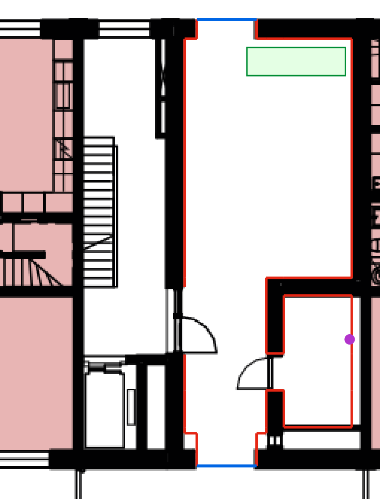
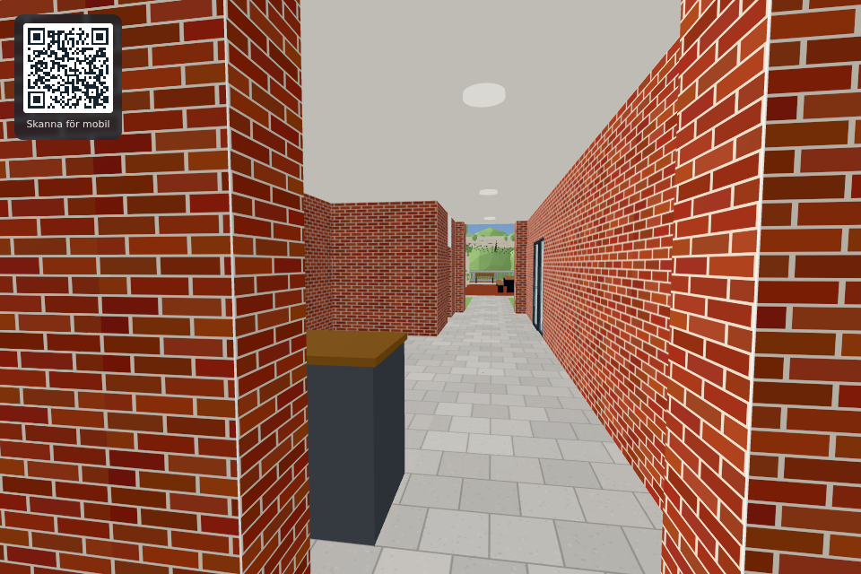
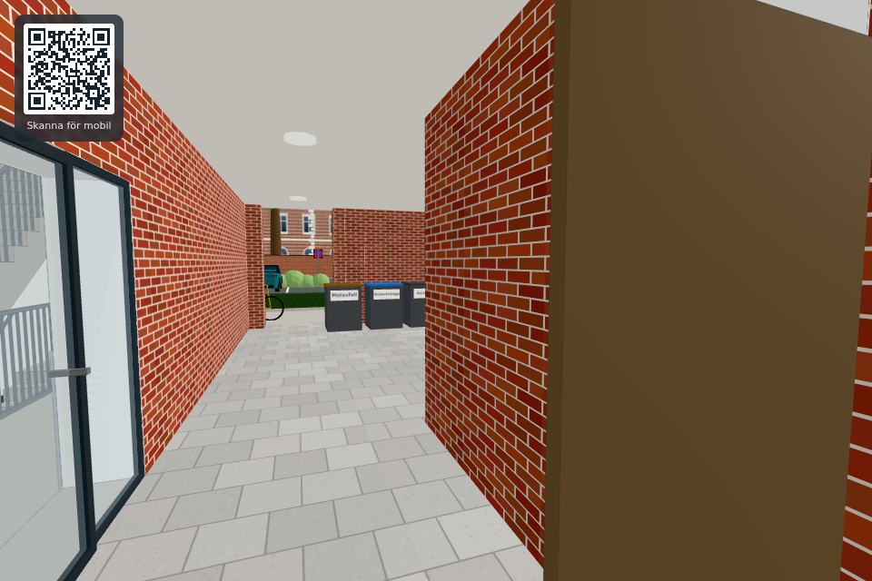
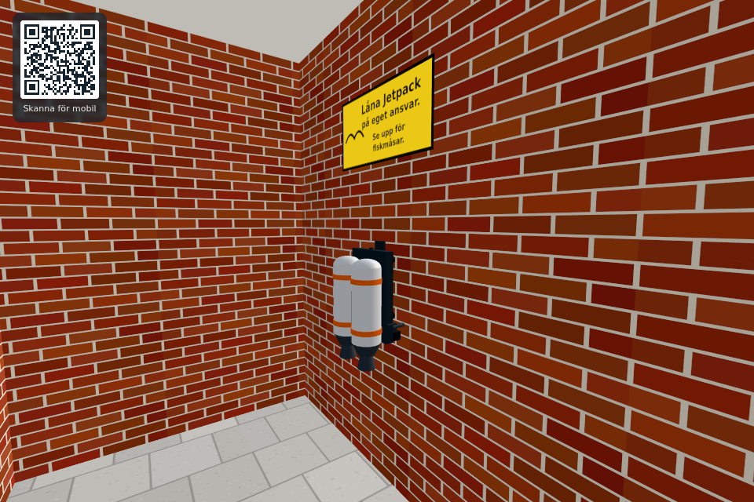

# Portiken mot sida 47 – issue #520

Underlag: [Peabs planritningsbroschyr, tryckt sida 47](../../peab/lunden-planritningsbroschyr-webb-2024-12-18.pdf), våning 1. PDF:ens sida 24 är uppslaget 46–47; ritningen är på högra halvan. Den befintliga [kalibrerade PNG:n](../../peab/kalibrerad/vaning-1-300dpi.png) använder modellkoordinater x = (px − 1909,5) × 0,042356 och z = (py − 1073) × 0,042356. Ingen ny skala har gissats.

Rött visar modellens invändiga vägggränser direkt på ritningen. Blått visar de befintliga öppningarna mot gata och gård. Grönt visar sopbehållarnas placering; lila är jetpackens krok. Kärnans trappa och hiss är befintliga och ingår inte i den röda konturen.

Den tidigare raka, 1,7 m breda tunneln fyllde ritningens bredare öppna del och det mindre rummet med solid massa. Nu modelleras den öppna delen och rummet. När man går från gatan mot gården ligger dessa till vänster; modellens x ökar åt det hållet i den vyn. Trapphusets glasade dörr ligger på motsatta sidan. Det mindre rummets dörr ligger något längre mot gården än trapphusdörren, enligt ritningen.

| Del | Modellens invändiga gränser i meter | Tolkning |
|---|---|---|
| Öppen del | x −16,12…−11,37; z 0,55…7,35 | 4,75 m bred; ansluter utan dörr till genomgången |
| Fortsatt genomgång | x −16,12…−13,80; z 7,35…11,77 | Bredare än de båda mynningarna |
| Mindre rum | x −13,30…−11,37; z 7,85…11,60 | Cirka 1,93 × 3,75 m |
| Rummets dörr | väggmitt x −13,55; z 9,50…10,55 | 1,05 m öppning genom cirka 50 cm vägg; öppnar ut mot genomgången |
| Befintliga mynningar | x −15,775…−14,075; z 0 respektive 12,699 | Behållna placeringar och bredd |

Gränserna är grafiskt avlästa från försäljningsritningen, inte uppmätta på plats. Rimlig avläsningsosäkerhet är cirka 5–10 cm. Portikens fria höjd 3 m, dörrens höjd/material, tegel invändigt, belysning och golv är modellantaganden; ritningen ger inte dessa detaljer. Rumsfunktionerna saknar etiketter. Soptunnor och jetpack är användarens föreslagna spelplaceringar, inte påståenden om byggnadens verkliga användning.

Sopbehållarna står vid den öppna delens gatvägg, centrum x −12,95/z 1,20 med 1 m mellanrum, utan att blockera genomgången eller trapphusdörren. Deras befintliga tre sorteringskategorier, mått och interaktioner behålls. Jetpacken hänger på det mindre rummets östra vägg, x −11,39/z 9,10, krok 1,45 m över golvet och skylt ovanför. Kroken och alla återgångar hämtar samma konfiguration. Flygning tillåts inte genom portikens tak.

Kamera x −15/y 1,62/z −1,3. Den bredare delen med behållarna ligger till vänster; trapphusdörren ligger till höger.

Kamera x −15/y 1,62/z 11,1. Rummets öppna dörr till höger, trapphuset till vänster och sopbehållarna längre fram. Tegelytorna är förskjutna 6 mm in mot hålrummet för att undvika flimmer mot bakomliggande solid massa.

Kamera x −12,6/y 1,62/z 10,8. Krok, jetpack och skylt står innanför rummets gränser.

Verifiering: `tools/portiktest.html` går från båda mynningarna in i båda utrymmena, kontrollerar verkligt ihålig geometri, väggkollisioner, stängd/öppen dörr, val och användning av jetpack, takets flygspärr och alla tre sopbehållares verkliga handlingar. Testet kontrollerar sparning, faktisk omladdning och faktisk återställning av hemmet. `tools/walktest.html` bevakar befintliga gångvägar genom portiken och trappan. `tools/lifttest.html` bevakar trapphusdörr, hiss och samtliga trappvåningar. `tools/jetpacktest.html` bevakar hela flyg-/landnings-/sparningscykeln från den nya kroken; sikte på en nedställd jetpack använder dess faktiska träffyta i stället för en fast kameravinkel.
