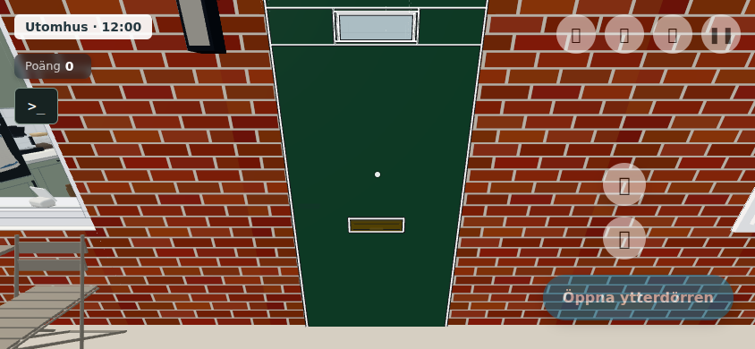
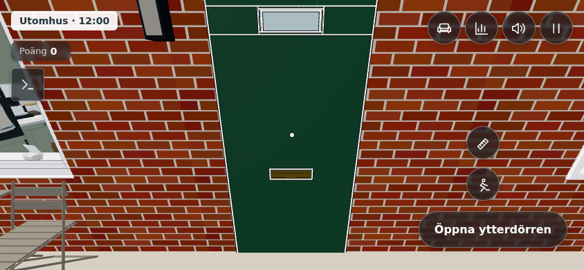
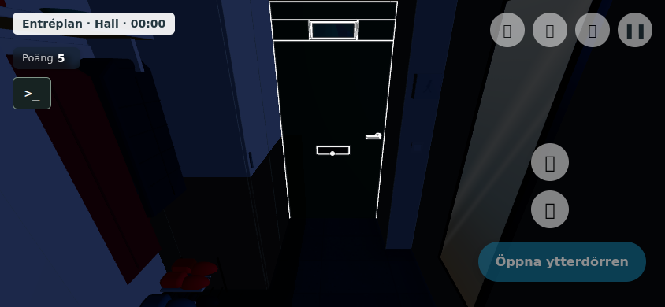
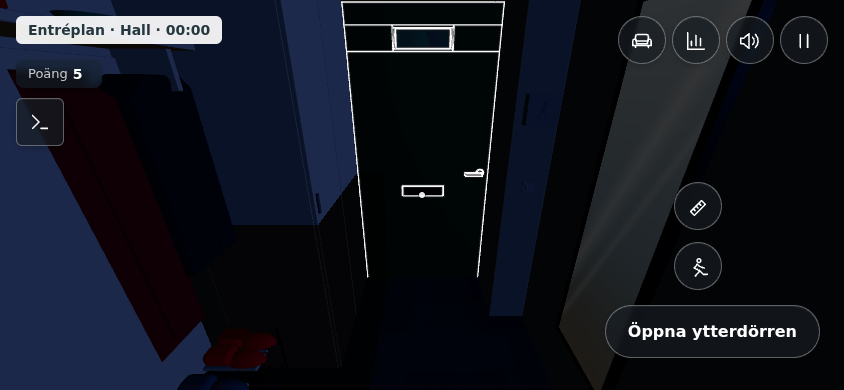
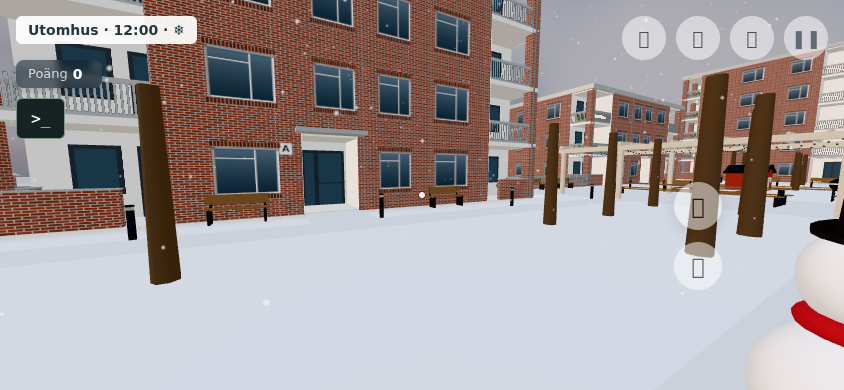
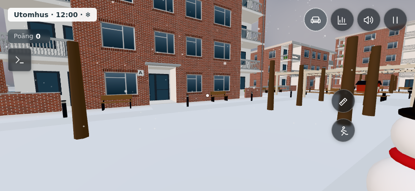
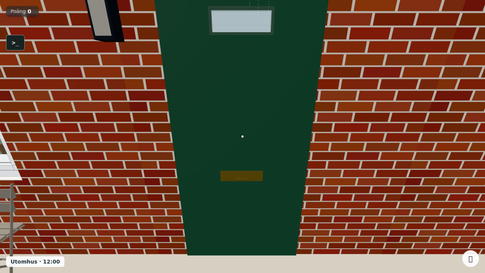
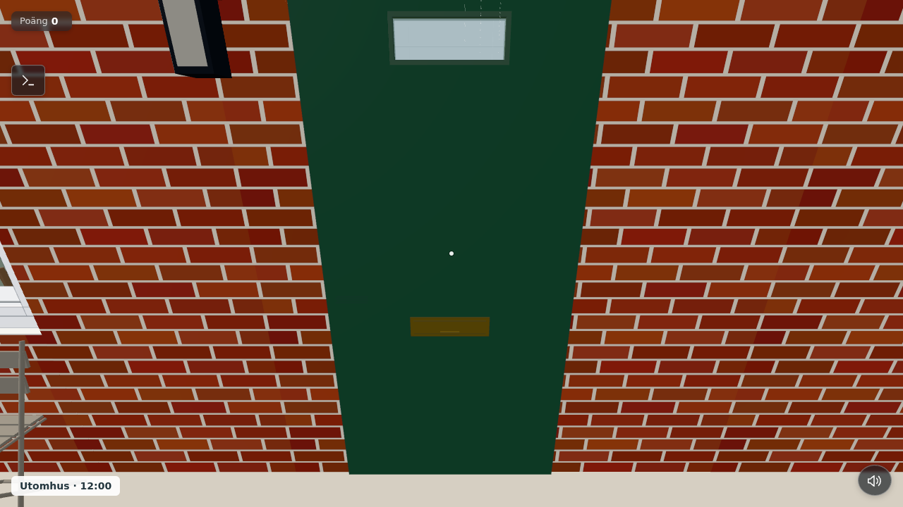

# Skärmkontroller – issue #525

Egna SVG-linjeikoner i `src/hudicons.js`: 24 × 24 enheter, linjetjocklek 1,7, neutral `currentColor`. Gemensam glasstil i `src/hudicons.css`: 2 px blur, vit kant och mörk transparent yta. Bakgrunden ger cirka 5,8:1 kontrast för vit text även ovanpå en vit scen. Text/ikoner har full opacitet; genomskinligheten ligger i bakgrunden.

| Kontroller | Utformning och verifierad funktion |
|---|---|
| Möbler, mätning, hukning, statistik, paus, ljud, terminal | Linjeikoner, minst 48 × 48 px tryckyta, tillgängligt namn och tooltip. Möbler/hukning/mätning/ljud visar aktuellt tillstånd. |
| Action, flera handlingsval, resa sig | Kontextberoende text kvar; samma neutrala glasytor. Vald, nedtryckt och blockerad handling har olika neutral fyllning/kant/opacitet. |
| Alternativ handling och vridning | Strömikon för den vanliga alternativhandlingen, egen bollikon för att studsa basketbollen; vridningspil vid placering/ommöblering. |
| Jetpack upp/ner; värme- och dammindikator | Linjepilar och egna raket-/dammsugarikoner. Indikatorernas mätvärden och varningstillstånd behålls. |
| Klocka, Sonos och gardin/plissé | Spela/pausa och riktning följer det verkliga tillståndet. Volym och spola/bläddra använder samma linjespråk. |
| Bok, kalender, teckningsvisning, rita | Gemensamma bläddrings-/stängningsikoner; släng har en diskret linjeikon och kort text. Pennfärgspaletten visar de faktiska valbara färgerna. |
| Terminal, ommöbleringshjälp och uppdateringsrad | Samma glasstil på befintliga textknappar; texten beskriver återställning/avbrytande. |
| Fotoanslagstavla och uppdragslapp | Spara/släng på varje foto får linjeikoner och kort text; Gör igen och tipsknappen använder samma neutrala ytor. Kalenderdagar är 44 px och panelen kan rullas på små skärmar. |
| Stängningsknappar i statistik och kontextdialoger | Samma linjekryss, `aria-label`, tooltip och stora tryckytor. |

Alla SVG:er har `aria-hidden` och `pointer-events:none`: knappens befintliga klickhanterare får fortfarande händelsen. Inga nya styrgester eller 3D-renderingspass tillkommer. Ikoner byts bara när ikonens tillstånd ändras. Knapparnas befintliga id:n och handlingar behålls.

Om backdrop blur saknas används en något tätare transparent yta. `hud-no-blur` kan användas för att verifiera samma fallback i en modern webbläsare. Blurrad och oblurrad yta använder samma 3D-draw-count (779 i kontrollscenen). Kontrollens `@supports` fungerar också med Safari-prefix. Inga externa ikonbibliotek eller bildhämtningar behövs.

## Telefon, dagsljus

| Före | Efter |
|---|---|
|  |  |

## Telefon, mörk interiör

| Före | Efter |
|---|---|
|  |  |

## Telefon, snö och ljus bakgrund

| Före | Efter |
|---|---|
|  |  |

## Dator

| Före | Efter |
|---|---|
|  |  |

Verifierat i Chromium med telefonvy 844 × 390 och datorvy 1280 × 720. Detta är webbläsarkontroller och mobilvy, inte en mätning på fysisk mobilhårdvara. Blurens radie är samma lilla 2 px som telefonkontrollerna hade tidigare; det nya formspråket kräver inga nya 3D-passar.

`tools/hudiconstest.html` kontrollerar ikoninventering, namn/tooltips, linjetjocklek, emoji-fria knappar, tryckytor, verkliga knapphandlingar, basketbollens alternativhandling, dynamiska ikoner, normala/aktiva/inaktiva tillstånd, läsbar no-blur-fallback och oförändrat draw-count. Alla 23 ikonkontroller passerar. Befintliga `touchtest`, `clocktest`, `blindtest`, `sonostest`, `boardtest`, `calendartest` och `taskstest` passerar.
