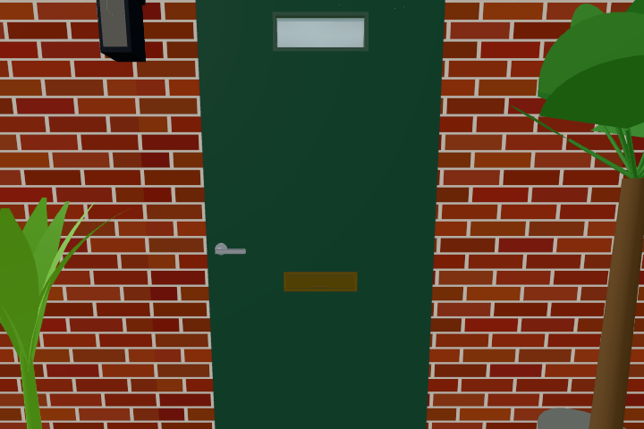

# Focused objects stay visible (#548)

The temporary brightness material inherited its source's lamp shader, but the periodic lamp scan treated the clone as a new unpatched material. A second insertion declared lamp uniforms/functions twice and broke shader compilation. LampWashes now follows the source material; the brightness wrapper uses its current compile hook/cache key so discovery during focus also works.

Browser verification used Chromium with SwiftShader, pinned Three.js 0.170.0. The same rendered Standard/Physical regression produces 45 → 0 before the fix and 45 → 50 after it; removing focus restores exactly the original pixels. `interactionoutlinetest.txt` includes the closed entry door's actual action target, one lamp declaration after repeated scans, discovery while already focused, existing shader hooks/live state, ordinary occlusion and selected-instance rendering. `lighttest` covers real switches, lamps, colour changes, time changes and shader coverage through both floors. Its coverage check follows delegated source materials too.

The scene image was rendered from outside at midday with the actual closed entry door focused, then explicitly rescanned twice. Its opaque green leaf, hardware and glass remain visible. No extra scene geometry, light or render pass was added.
