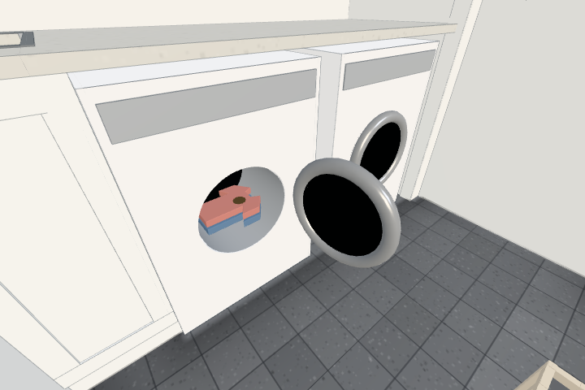

# Laundry loading (#550)

Three dirty dry shirts start in the open slatted laundry basket against Tvätt's east wall. Existing item actions load/unload the washer and dryer through their actual open drums. The white machine shells have real openings; clothes remain inside static anchors when the doors swing. Wet/dry is an independent saved field, never a cleanliness value.

All dimensions, basket placement, capacity and small garment proportions in LAUNDRY are assumptions; the fitted machines retain their existing plan locations. Basket collisions leave the central route free. At most seven additional draws show the dirty basket stock (one merged basket, one cloth and one dirt patch per garment); hidden machine contents add none. No new lights or render passes. Full perfcount before/after has unchanged draw counts at all its regular locations (Tvätt is out of view there).

Chromium/SwiftShader checks: laundrytest ALL PASS (actual drum touch action, physical bounds, closed/full rejection without item loss, clean/wet independence, stable ids/restock and actual page reload), itemtest ALL PASS, walktest ALL PASS and perfcount ALL PASS.

This is the loading part of #395. Washing programmes and drying/folding/storage follow in #551 and #552.
