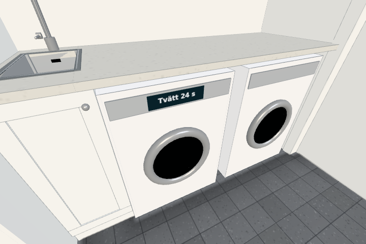

# Saved wash programme (#551)

The washer's existing fascia has a small start/status display. Its assumed 35 game-second programme requires a closed door and dirty load. Opening pauses; closing fully resumes. New loading stays blocked during a programme, while paused unloading is allowed. Only original start ids still inside become clean and wet at completion. Removed or later inserted items stay unchanged. F cancels without washing anything.

Life's laundry extra saves exact remaining game time and start ids; no timestamp or offline progress. The expanded laundrytest checks real touch start, actual page reload with exactly preserved time, independent wet/clean state, removal/replacement membership and cancellation. It passes all loading and programme checks. The dishwasher's life2test section 385 also passes. Perfcount remains unchanged at its normal locations (Tvätt out of view); the control display adds one draw when in view, no light/pass. The existing generic pump sound follows running/paused/cancelled state.

