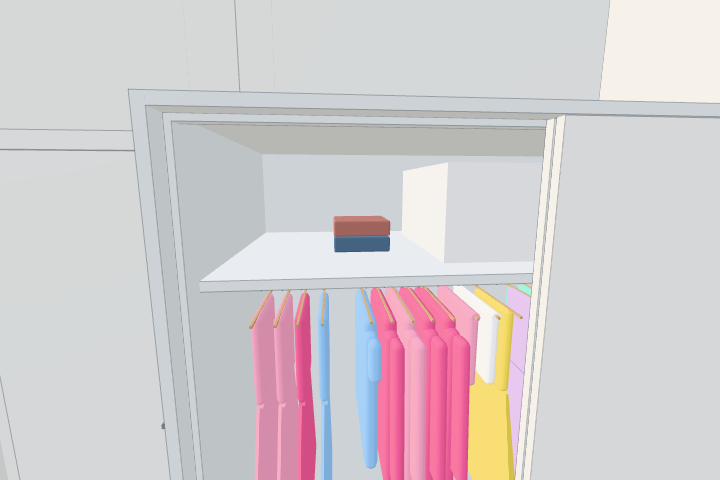

# Complete laundry cycle (#552/#395)

The original basket batch now moves through the washer (clean/wet), dryer (clean/dry), folding (same ids, smaller thicker mesh) and existing bedroom wardrobe shelves. Programmes pause with the round doors and preserve exact game time/start ids between visits. Only clean dry folded garments can be stored. Two slots per wardrobe stack clothes on reserved quarter-shelf spaces; the correct sliding leaf must physically clear the garment width. Closed leaves hide/block access but never move or lose the stored items. A full shelf leaves the third garment in the hand; the second bedroom wardrobe can take it.

The 25-second drying time and wardrobe reserve/capacity/spacing are gameplay assumptions. Decorative bedroom shelf stacks leave space for the actual clothes; the hall's hats/coats are preserved. The dryer reuses the existing fan sound and adds one control display draw. Shelf registration adds no mesh/pass/light. Perfcount passes with unchanged calls at its normal locations; upstairs/park have 864 fewer triangles from the reserved decorative shelf space. Stored clean garments add one draw each when their shelf is exposed.

Chromium/SwiftShader: the complete laundrytest passes loading, touch programme controls, dirty/wet rejection, pause/membership, washer/dryer real reloads with exact time, actual wardrobe touch storage, full capacity with original ids intact, full-flow real reload and the actual reset control followed by a fresh page. wardrobetest passes all 315 seam rays plus both panels' travel/access checks. walktest passes existing routes; perfcount passes. The folding bounds test measures the rendered cloth geometry in its own frame so camera/held rotation cannot change its thickness comparison.

