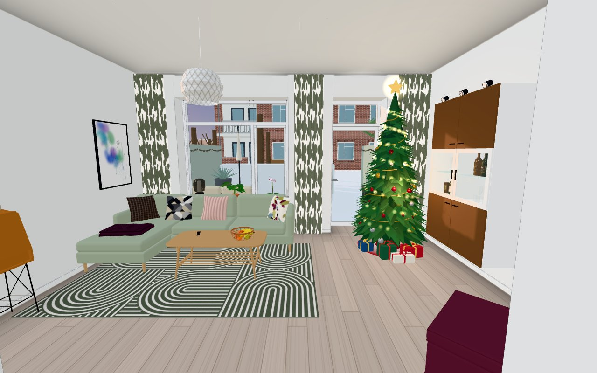
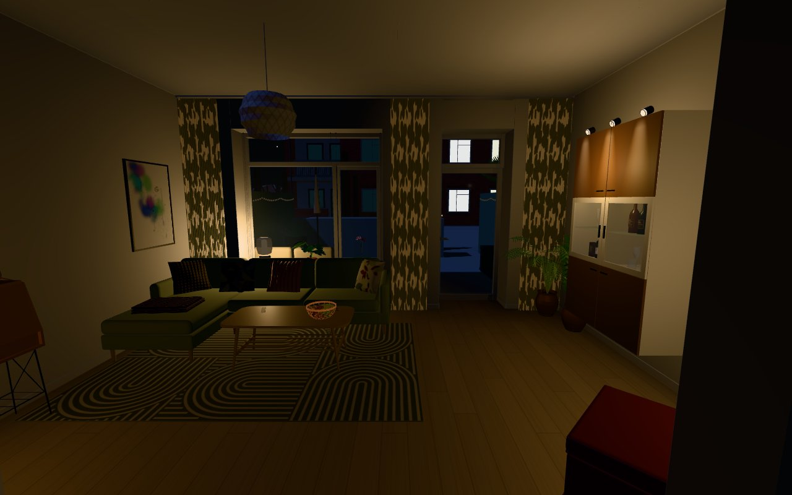
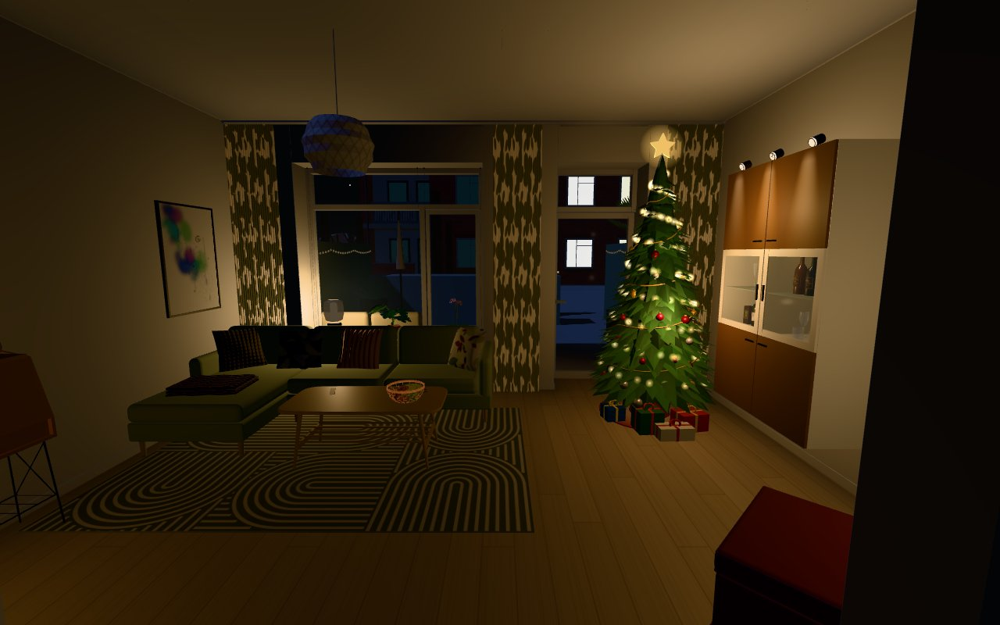
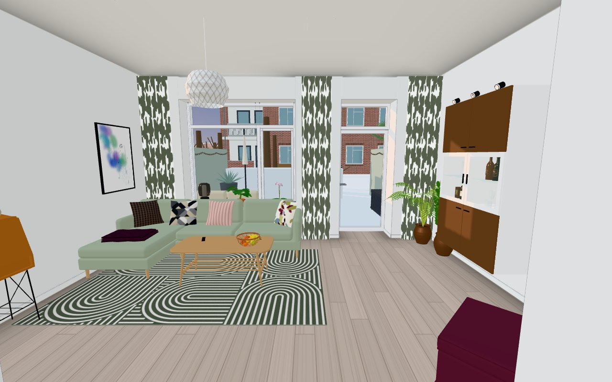
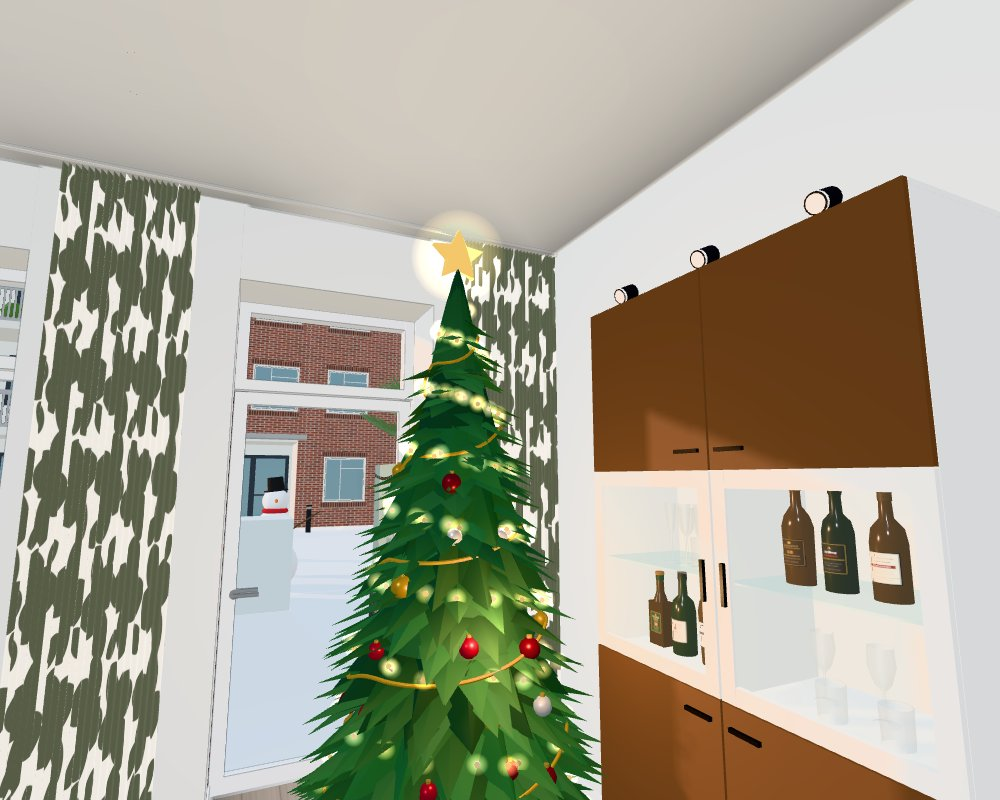
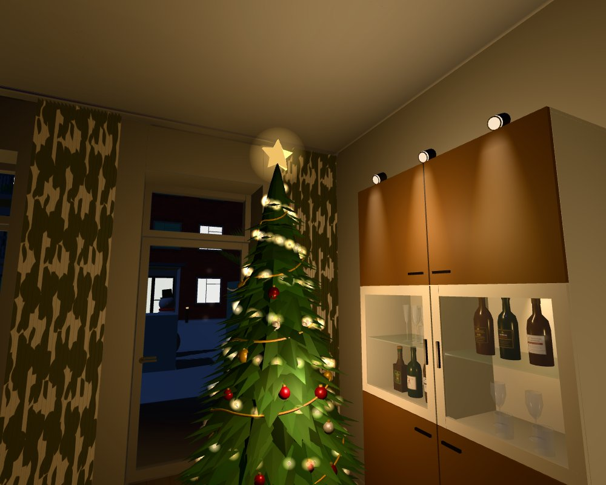
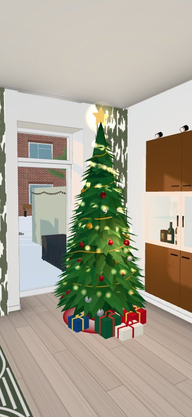
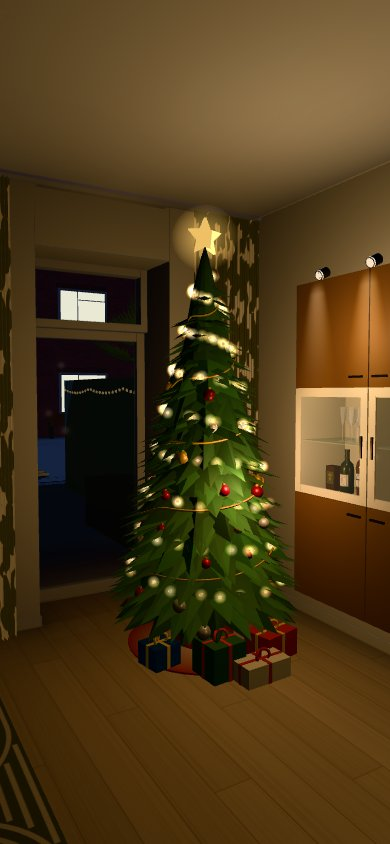

# Issue #571 — seasonal Christmas tree

Headless Chromium (SwiftShader), local `tools/devserve.py`. "Before" = main at c4fa765 (no tree), "after" = this change.
Same camera, time and date in each pair (`?shot&at=…&time=…&freeze&month=12&day=10`).

## Default spot: the right-hand corner

The issue gives no plan coordinate. The normal way into the living room is the doorway from the passage in the north
wall; standing there and looking into the room (south, towards the window and the patio door), the right-hand corner is
the SW corner by the window, where the palm and the ZZ plant stand. The tree goes there (`FURNITURE` `xmastree`,
x 1.08, z 11.5), pulled out of the very corner so its crown (radius 0.55 m) clears the wall-hung BESTÅ (ends at
z 11.15) and the south wall (z 12.06); the two plants under its crown are hidden while it stands. Living-room RH is
3.0 m (bofakta): the crown reaches 2.5 m, the star's tip 2.80 m (measured in christmastest), ~0.2 m under the ceiling.
Every size, colour and count is a visual *guess* (`XMAS_TREE` in `src/config.js`).

| | before | after |
|---|---|---|
| doorway, noon, 10 Dec |  |  |
| doorway, 22:00, 10 Dec |  |  |
| doorway, noon, 7 Jan (out of season: as before) | — |  |

Close-ups (noon / 22:00) and the phone format (390 × 844, noon / 21:00):

 

 

## Rendering cost

- The tree itself, the doorway view at night (desktop 1280 × 800): 505 → 513 draw calls (+8: crown, matte parts,
  baubles/garland, star, star stem, bulb cores, bulb halos, star halo), +19.6 k triangles. Phone view (390 × 844):
  302 → 310 calls, +19.6 k triangles. No light is added: one pool-light anchor shares the existing pool / lamp wash.
- The shimmer: 160 instance colours + 160 point colours recoloured on the CPU, 0.016 ms per frame (SwiftShader host).
- Re-judging what the tree hides (load, a furniture move, F, a date change; never per frame): ~27 ms once.
- `tools/perfcount.html` ([perf.log](perf.log); `?month=12&day=10`, `&w=390&h=844` for the phone frame): July
  (out of season) is identical to before at every spot. In December the "living" spot (looking south) has the same
  355 calls and fewer triangles (675 k vs 721 k: the hidden palm and ZZ plant are heavier than the tree); phone
  "living" 249 → 253 calls, +18 k triangles; "start" +2 calls.

Desktop SwiftShader numbers are not phone frame rates; a real device check is still worth doing.
