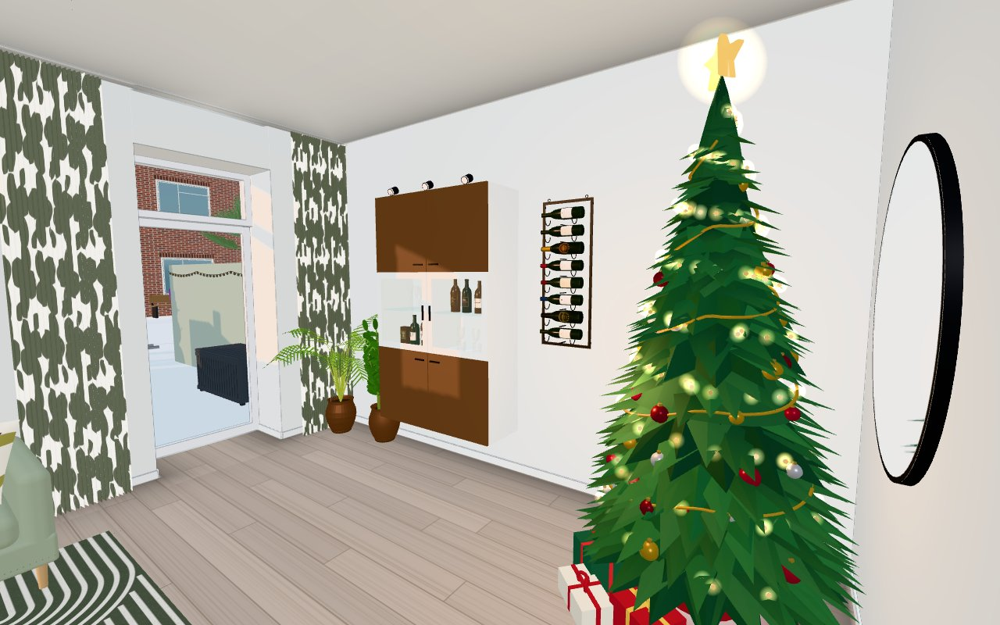
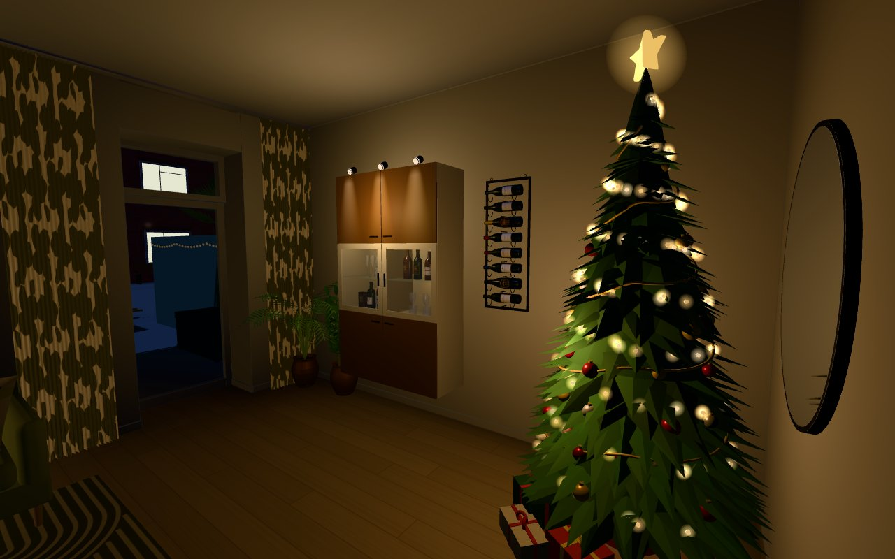

# Issue #591 — the Christmas tree's default spot: the corner right of the vitrine

Headless Chromium (SwiftShader), local `tools/devserve.py`, 24 December
(`?life&shot&freeze&month=12&day=24&time=12|22&at=3.1,8.1,125,-5`: just inside the living-room doorway, turned towards
the west wall).

The user: "hörnet till höger om vitrinskåpet". Seen from the doorway the wall-hung BESTÅ hangs on the right-hand
(west) wall; #571 had the tree to its left (the SW corner by the patio door,
[issue-571](../issue-571/after-dec-door-day.jpg)). The corner to its right, nearer the doorway, is the NW corner — the
armchair corner. The tree now stands there (`FURNITURE` `xmastree`, x 0.82, z 8.45, rot −135 so the presents face the
room; *guess*): the crown (r 0.55) keeps 5–8 cm off the west wall and the passage wall, ends ~1 m before the BESTÅ
(z 9.95) and ~0.8 m west of the doorway (x 2.15–3.25). Because the corner sits right beside the doorway, a view
straight south from the door no longer shows it; the shots turn towards the west wall.

While it stands the armchair, the stool, the NYMÅNE floor lamp and the RANDERS tray table are hidden (#571's season
layer; their saved poses are untouched). The palm and the ZZ plant by the window stay. The doorway and the way into the
room stay free (christmastest checks `player.isFree` at the doorway and beside the tree).

A pose confirmed under the #571 layout id carries over; an entry still at the old default (a full reset writes every
home pose) is dropped so the new default applies (rearrange.js `carryOld`; christmastest covers both).

| noon, 24 Dec | 22:00, 24 Dec |
|---|---|
|  |  |
